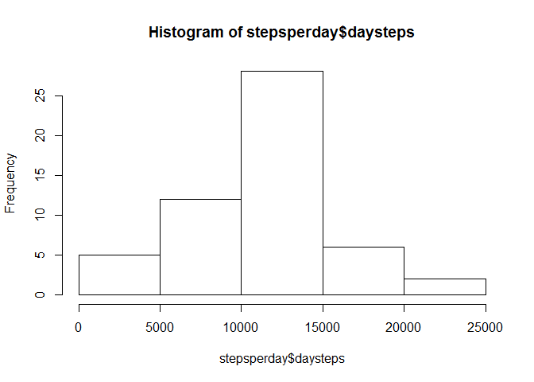
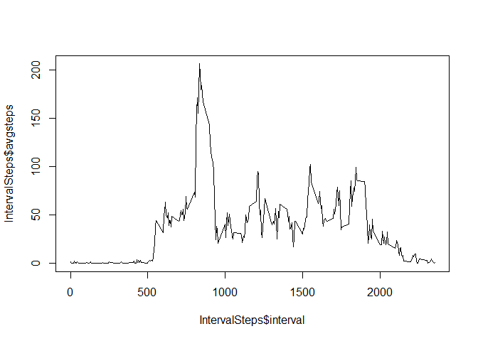
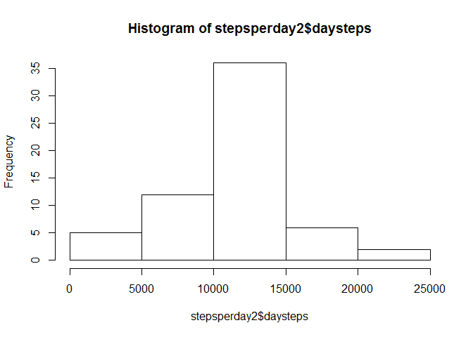
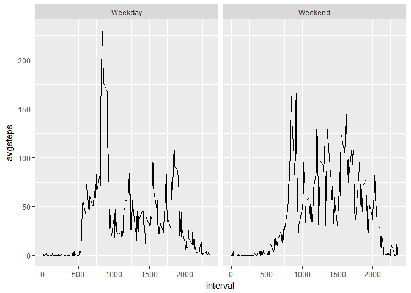

# Reproducible Research: Peer Assessment 1


```r
library(dplyr)
```

```
## 
## Attaching package: 'dplyr'
```

```
## The following objects are masked from 'package:stats':
## 
##     filter, lag
```

```
## The following objects are masked from 'package:base':
## 
##     intersect, setdiff, setequal, union
```

```r
library(ggplot2)
```

## Loading and preprocessing the data

```r
steps <- read.csv("activity.csv")
steps$date <- as.Date(steps$date)
```


## What is mean total number of steps taken per day?


```r
stepsperday <- steps %>% group_by(date) %>% filter(!is.na(steps)) %>% summarize(daysteps = sum(steps))
hist(stepsperday$daysteps)
```

<!-- -->

```r
stepsperday %>% summarize(meanSteps = mean(daysteps), medianSteps = median(daysteps))
```

```
## # A tibble: 1 x 2
##   meanSteps medianSteps
##       <dbl>       <int>
## 1  10766.19       10765
```

## What is the average daily activity pattern?


```r
#Graph the average steps by interval across all days
IntervalSteps <- steps %>% group_by(interval) %>% filter(!is.na(steps)) %>% summarize(avgsteps = mean(steps))
plot(x= IntervalSteps$interval, y = IntervalSteps$avgsteps, type = "l")
```

<!-- -->

```r
# Find the interval with the highest average steps
HighestIntervalIndex <- order(IntervalSteps$avgsteps, decreasing = TRUE)[[1]]
IntervalSteps$interval[[HighestIntervalIndex]]
```

```
## [1] 835
```


## Imputing missing values

```r
#Calculate total number of missing values
sum(is.na(steps$steps))
```

```
## [1] 2304
```

```r
#replace NA values with mean for that interval
stepsImputed <- steps %>% group_by(interval) %>% mutate(steps = ifelse(is.na(steps), mean(steps, na.rm = TRUE), steps))

#Create a new histogram and calculate a new mean and meian
stepsperday2 <- stepsImputed %>% group_by(date) %>% filter(!is.na(steps)) %>% summarize(daysteps = sum(steps))
hist(stepsperday2$daysteps)
```

<!-- -->

```r
stepsperday2 %>% summarize(meanSteps = mean(daysteps), medianSteps = median(daysteps))
```

```
## # A tibble: 1 x 2
##   meanSteps medianSteps
##       <dbl>       <dbl>
## 1  10766.19    10766.19
```

```r
#Note, the mean stays the same but the median increases.
```


## Are there differences in activity patterns between weekdays and weekends?


```r
#Create a Weekday Factor
stepsImputed$Weekday <- as.factor(ifelse (weekdays(stepsImputed$date) %in% c("Saturday","Sunday"), "Weekend","Weekday"))

#Graph the average steps by interval across all days
IntervalSteps2 <- stepsImputed %>% group_by(Weekday, interval) %>% filter(!is.na(steps)) %>% summarize(avgsteps = mean(steps))
qplot(x=interval, y = avgsteps, data = IntervalSteps2, facets = . ~ Weekday, geom = "line")
```

<!-- -->

